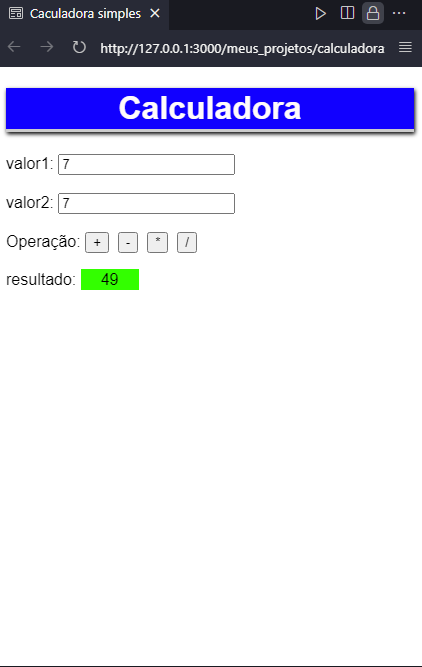

# 
Meu reposiótio de estudos de html / css / JavaScript.

## Meus primerios projetos
Durante o meu aprendizadod de front end eu estou aprendendo muitas coisas legais! E confesso que as vezes eu sinto dificuldades, mas o importante é não desistir!
Confira alguns dos meus melhores projetinhos por enquando:
### - layout de Escolher planos 

### - Calculadora v1.0

## Com o tempo eu vou atualizando esse repositório, até mais 👋.
